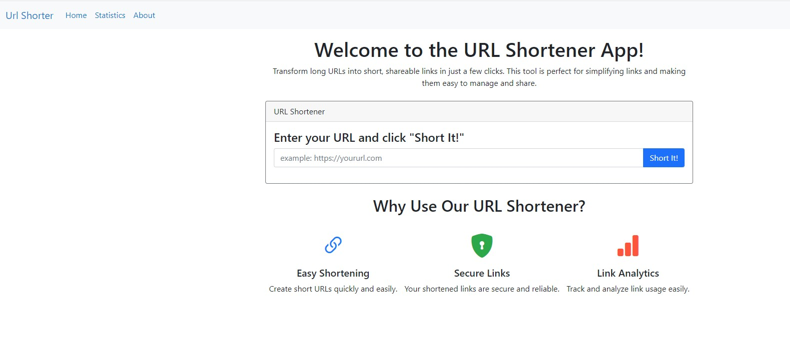
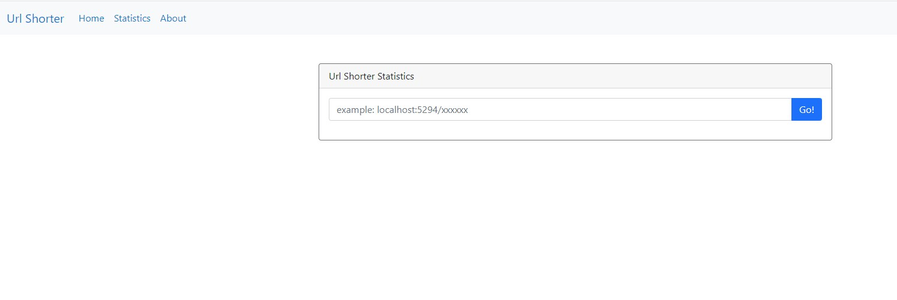
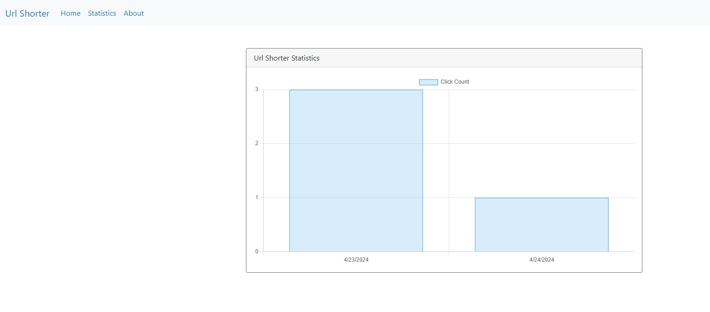
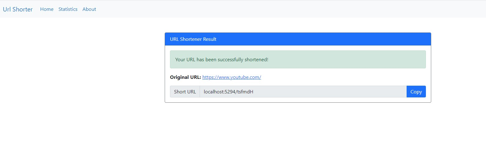

# URL Shortener

URL Shortener is a web application designed to transform long, cumbersome URLs into short, easy-to-share links. This project uses ASP.NET Core MVC and implements advanced architectural patterns, such as Onion Architecture and Unit of Work, to maintain a clean and scalable codebase.

## Table of Contents
- [Features](#features)
- [Architecture](#architecture)
- [Techniques Used](#techniques-used)
- [Getting Started](#getting-started)
- [Contributing](#contributing)
- [License](#license)

## Features
- **Shorten URLs**: Convert long URLs into short, shareable links with a single click.
- **Analytics**: Track the number of times a shortened URL has been accessed.
- **URL Redirection**: Redirect users from a short URL to the original URL.
- **Copy to Clipboard**: Easily copy shortened URLs for sharing.
- **Responsive Design**: The application is designed to be responsive and mobile-friendly.

## Architecture
This project follows Onion Architecture to separate concerns and ensure a clean codebase. Key components of the architecture include:

- **Domain Layer**: Contains the core business logic, entities, and interfaces for repositories.
- **Application Layer**: Contains service logic and data transfer objects (DTOs) for communication between layers.
- **Infrastructure Layer**: Contains data access logic, including Entity Framework Core, and external dependencies.
- **Presentation Layer**: The ASP.NET Core MVC layer for handling HTTP requests and rendering views.

The project also uses the following design patterns:

- **Unit of Work**: Manages database transactions, ensuring that operations are atomic and consistent.
- **Repository Pattern**: Abstracts data access logic, promoting a clean separation between business logic and data storage.
- **Dependency Injection**: Allows for decoupled components and easier testing.

## Techniques Used
- **Entity Framework Core**: For data access and ORM.
- **AutoMapper**: For mapping entities to DTOs and vice versa.
- **Chart.js**: For visualizing data in charts on the frontend.
- **Bootstrap**: For responsive design and consistent styling.
- **Attribute Routing**: For flexible and clean routing in ASP.NET Core MVC.

## Getting Started
To run the project locally, follow these steps:

1. **Clone the Repository**:
   ```bash
   git clone https://github.com/kodkopat/UrlShorter.git
   ```

2. **Navigate to the Project Directory**:
   ```bash
   cd UrlShorter
   ```

3. **Restore Dependencies**:
   ```bash
   dotnet restore
   ```

4. **Run the Project**:
   ```bash
   dotnet run
   ```

## Contributing
Contributions are welcome! To contribute to this project:

- Fork the repository.
- Create a new branch for your changes.
- Submit a pull request with a detailed explanation of your changes.

Please ensure your code adheres to our coding standards and includes relevant tests.

## License
This project is licensed under the MIT License.
        
## Application Screenshots

Here are some screenshots from the application to give you a better understanding of its layout and features:

1. **Home Page**:
   

2. **Statistics Page**:
   

3. **Statistics Page**:
   

4. **Shortened URL Page**:
   
